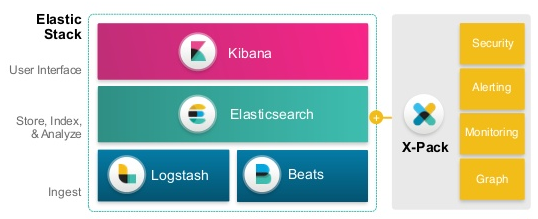

# Qumulo Audit Logs with ElasticSearch and Docker

## Table of Contents

   * [Introduction](#introduction)
   * [Examples](#examples)
   * [Architecture](#architecture)
   * [Prerequisites](#prerequisites)
   * [Get Docker Config Files](#get-docker-config-files-for-qumulo-audit-logs-and-elasticsearch)
   * [Edit Filebeat Config File](#edit-filebeat-config-file)
   * [Setting Docker cluster for Filebeat execution](#setting-docker-cluster-for-filebeat-execution)
   * [Edit Logstash Config File](#edit-logstash-config-file)
   * [Deploy Elastic Stack](#deploy-elastic-stack)
   * [Validating Elastic Stack](#validating-elastic-stack)
   * [Verify Elasticsearch is indexing data](#verify-elasticsearch-is-indexing-data)
   * [Importing Index Patterns, Dashboard, and Visualizations](#importing-index-patterns-dashboard-and-visualizations)
   * [Examining and search raw Qumulo logs in Elasticsearch](#examining-and-searching-raw-qumulo-logs-in-elasticsearch)
   * [Viewing Qumulo Logs through the Dashboard](#viewing-qumulo-logs-through-the-dashboard)
   
## Introduction

The following instructions will allow a user to create a fully functioning Docker implementation of
ElasticSearch that will ingest and visualize Qumulo Core Audit Logs. Additionally, with ElasticSearch,
you will be able to search, analyze, and report on any data provided by the Qumulo Core audit logs.

Elasticsearch, also often called the Elastic Stack, is composed of:

  

## Examples

Throughout this README file, you will see where we recommend that you install rsyslog, docker, and
the Elasticsearch stack.

Our examples for rsyslog and docker utilize the Ubuntu 18.04 Linux operating system. While you can use
any linux version that you are comfortable with, if you choose not to use Ubuntu, then you will have
to determine how to configure rsyslog and how to install docker yourself.

You should note that one of the benefits of docker is that it doesn't matter what the linux version is
for the applications run on the docker cluster. Docker will automatically load any features needed by
the application that are not available within the linux version that you ultimately choose. With that in
mind, you will not need to change anything in the instructions in order to get the Elastic Stack installed
and configured since it runs within Docker. 

## Architecture

The architecture used is shown in the table below
<table>
  <tr>
    <th>High level design</th>
    <th>In scope</th>
  </tr>
  <tr>
    <td></td>
    <td>Filebeat and Logstash for qumulo audit log files are used. 4x Elasticsearch and 1x Kibana are used</td>
  </tr>
  <tr>
    <td></td>
    <td>Logstash will filter and format the data into JSON for ElasticSearch</td>
  </tr>
</table>

Full reporting is possible, but that is a paid feature included only in the Enterprise edition. 
For the full list of free features that are included in the basic license, see: https://www.elastic.co/subscriptions

As you can see by the above High Level Design diagram, the Qumulo cluster uses rsyslog (builtin to standard
Linux implementations) to write the Audit Logs from a Qumulo cluster to the directory **/var/log/qumulo**
on a rsyslog server.

Then, using the instructions from this documentation, you would create a docker swarm implementation that
will create a cluster of running applications that use

* **Filebeat** to read the rsyslog files from the /var/log/qumulo directory
* **Logstash** to take the audit logs from Filebeat and process them through various filters
* **Elasticsearch** to store and index the audit logs from Logstash
* **Kibana** to visualize or report on the data from Elasticsearch

## Prerequisites

Several things have to happen before we can install the Elastic Stack and get the Qumulo Audit Logs
indexed so that we can analyze them.

If you follow the architecture diagram as a guide, you will see that we have:

- rsyslog
- the Elastic Stack; composed of beats, logstash, elasticsearch, and kibana

What you don't see is Docker. Since Docker is the fundamental to running the Elastic Stack for this
implementation, we need to have two prerequisites before we can install the Elastic Stack.

- rsyslog
- docker

### Identifying four Linux machines to run rsyslog and Docker

rsyslog and the Docker Engine run on Linux machines. Those machines could be either virtual or physical.

rsyslog will run on only one of the machines. With Docker, we will create a cluster using the four
machines; including the machine used for rsyslog. 

Elasticsearch is an indexing and searching engine that provides its best performance when it is
formed within an Elasticsearch cluster. To that end, we recommend that you build a docker cluster to
support Elasticsearch with 4 x virtual or physical machines. The composition of those machines should be,
at a minimum, 16GB of memory, 4 x cores, 10Gb ethernet, 200GB of free disk space (after OS install).

### Configuring rsyslog

So, let's start by configuring rsyslog to get the audit logs from the Qumulo Core Cluster and storing
them in files on one of the identified Linux servers

We have put together some easy to understand instructions to accomplish this task. Simply follow
this example for a [rsyslog configuration](./rsyslog-readme.md).

### Why Docker?

Docker is a tool designed to make it easier to create, deploy, and run applications by using containers. Containers allow a developer to package up an application with all of the parts it needs, such as libraries and other dependencies, and ship it all out as one package. By doing so, thanks to the container, the developer of the application can rest assured that the application will run on any Linux machine regardless of any customized settings that machine might have that could differ from the machine used for writing and testing of the application.

In a VERY small way, Docker is like a virtual machine. However, unlike a virtual machine, Docker allows applications to use the same Linux kernel as the system that Docker is running on and only requires applications be shipped with things not already running on the host computer. This gives a significant performance boot and reduces the size of the application by removing the overhead of loading and managing a complete guest OS.

### VM Map Count for Elasticsearch

Elasticsearch uses a mmaped directory by default to store its indices. The default for most Linux
operating systems on mmap counts is likely to be too low, which may result in out of memory exceptions.

So, you will need to set them higher in order for Elasticsearch to run with no errors. The commands
are:

  * `sudo sysctl -w vm.max_map_count=262144`
  * `sudo echo 'vm.max_map_count=262144' >> /etc/sysctl.conf` (to persist reboots)

### Configure the Docker Engine to run on your four machines

We have taken the guess work out of getting Docker installed and running on your four virtual or
physical machine.

The installation and configuration instructions for [Docker Engine](./docker-readme.md)

## Get docker config files for Qumulo Audit Logs and Elasticsearch

You will need these files to deploy Elasticsearch, Logstash, Kibana, and Beats. So, first SSH in to the
master node of the Docker Swarm cluster allocated to running Elastic Stack and clone this github repo by
following these commands:

  * `git version`
  * `git clone https://github.com/Qumulo/auditlogs-elasticsearch`
  * `cd auditlogs-elasticsearch`

## Edit Filebeat Config File

It is not necessary to change the Filebeat configuration file if you are willing to accept the defaults. However, if you find it necessary due to the location of the Qumulo Audit Logs or the Logstash network port, then please follow these instructions to change the filebeat.yml configuration file.

**Please note that your editor must understand how to deal with YAML type files. This is critical since YAML is very sensitive to tabs versus spaces in the file format. YAML will only accept spaces and not a tab character.**

**EDIT** is equal to the name of your favorite text based editor.

  * `EDIT $PWD/elk/beats/filebeat/config/filebeat.yml`
  * Change `paths:` to the location of the Qumulo audit log files on the syslog server
  * Change `logstash:10514` in the `output.logstash` definition if port 10514 is not available

## Setting Docker cluster for Filebeat execution

Filebeat must run on the node of the docker cluster that is also the syslog server for the Qumulo cluster. Since Filebeat doesn't know on which node the syslog server is running, we must have a way to inform docker where Filebeat is to run. Enter the concept of **docker labels**.

Docker labels are metadata that describe the node, like its role, its region, or the kind of disk available. With a label, we can add a deployment constraint so that Filebeat starts only on the node running syslog.

* `ssh to the docker node running syslog`
* Run the command `docker node update --label-add Filebeat=true NODENAME`
* **NODENAME** should be the machine name of the node (i.e. dq2-a-40g)

If you are unsure of the **NODENAME**, then run the command `hostname` and plug that value into the above command in place of the **NODENAME**

## Edit Logstash Config File

It is not necessary to change the Logstash configuration file if you are willing to accept the defaults. However, if you find it necessary due to the Logstash network port or the configuration of the Elasticsearch cluster, then please follow these instructions to change the logstash.conf configuration file.

**Unlike the Filebeat configuration file, Logstash just uses a standard text file. So, you will not have to worry about formatting for a YAML type file.**

**EDIT** is equal to the name of your favorite text based editor.

  * `EDIT $PWD/elk/logstash/config/pipeline/logstash.conf`
  * Change `port => 10514` to the same port used in the Filebeat configuration file.
  * Change `user => "qumulo"` OR `password => "changeme"` if required

**Change nothing else in this configuration file or the correct formatting of the Qumulo Audit Logs will not occur and Elasticsearch will index incorrect data.**

## Deploy Elastic Stack

* SSH in to the master node of the Docker Swarm cluster allocated to running Elastic Stack. Start by editing the deploy.sh script to change the following commands:

  * `export ELASTIC_VERSION=7.5.0`
  * `export ELASTICSEARCH_USERNAME=qumulo`
  * `export ELASTICSEARCH_PASSWORD=changeme`
  * `export INITIAL_MASTER_NODES=node1` _(Change the value of "node1" to the name of one of the machines running Docker in your swarm cluster. See Important discovery and cluster formation settings: https://www.elastic.co/guide/en/elasticsearch/reference/current/discovery-settings.html#initial_master_nodes)_
  * `export ELASTICSEARCH_HOST=node1` _(Change the value of "node1" to the name of one of the machines running Docker in your swarm cluster)_
* Deploy the Elastic Stack by executing the deploy.sh script
  * `./deploy.sh`

At this point, you should have started the Elasticsearch cluster and ELK stack. See! Wasn't that easy! 

_(Assuming you have four Docker nodes, this will deploy a reverse proxy, logstash, Kibana, and 4x Elasticsearch instances in Master / worker nodes configuration. Please note that Elasticsearch is configured to start as a global service. This means that Elasticsearch will be scaled out automatically as new Docker nodes are added to the Swarm cluster. Here is an explanation on various Elasticsearch cluster nodes: https://discuss.elastic.co/t/node-types-in-an-elasticsearch-cluster/25488)_

## Validating Elastic Stack

* Check status of the stack services by running the following commands:

  * `docker stack services qumulo`
  * `docker stack ps qumulo` _(address any error reported at this point)_
  * `curl -XGET -u ${ELASTICSEARCH_USERNAME}:${ELASTICSEARCH_PASSWORD} ${ELASTICSEARCH_HOST}':9200/_cat/health?v&pretty'` _(Inspect cluster health status which should be green. It should also show 4x nodes in total assuming you have four Docker nodes in the cluster)_

## Verify Elasticsearch is indexing data

Before the Index Patterns, Dashboard, and Visualizations can be loaded, you should first verify that Filebeat and Logstash are generating data and sending it to Elasticsearch.

* Start Kibana by opening a web browser and using a URL of ANY of the nodes in the Docker cluster. Docker is running a proxy which will intercept port 80 from any node in the cluster and send it to Kibana.
* Once you have Kibana visible, then click on the `management` icon

  

* Next, click on `Index Management` and verify that you have an Index called `qumulo-auditlogs` and that the Health is green and that the `Docs count` is incrementing. You can hit the `Reload indices` button to see the increase in `Docs count`.

  

## Importing Index Patterns, Dashboard, and Visualizations

* Before you can view any data, you must first import a valid Index Pattern, Dashboard, and Visualizations. Qumulo has created several sample visualizations and a dashboard that you can use to get started. 
* Start the import by clicking on the `Saved Objects` button on the Kibana window.

  

* Once that is loaded, click on the `Import` button at the top of the screen.
* Drag and drop the `qumulo-visualizations.ndjson` file from the `Visualizations` directory onto the `Import saved objects` window and hit the `Import` button.

  

* Finally, you will need to hit the browser reload button highlighted below. This step MUST be done in order for Kibana to load the new Index Pattern into its tables.

  

* When you are done, the screen should look like the following.

  

## Examining and searching raw Qumulo logs in Elasticsearch

* Elasticsearch has a very nice function to be able to examine and search for data within the index. This function is called `discover`. 
* Click on the `discover` button in Kibana

  

* You should see a screen like the one below. Do not worry if the records count are different as that is dependent upon your system. 

  

* At this point, you can search through the data by adding filters and selecting date ranges. Click the link for more information on [discover](https://www.elastic.co/guide/en/kibana/current/discover.html). 

## Viewing Qumulo Logs through the Dashboard

A Kibana dashboard is a collection of visualizations, searches, and maps, typically viewed in real-time. Dashboards provide at-a-glance insights into your data and enable you to drill down into details.

* To start working with dashboards, click `Dashboard` in the side navigation.

  

* You should now see the sample, but very real visualizations of the Qumulo Audit Logs. You can keep all of these, modify some, or add others to fit your needs. 

  

* For more information on [Dashboards](https://www.elastic.co/guide/en/kibana/current/dashboard.html) and [Visualizations](https://www.elastic.co/guide/en/kibana/current/visualize.html), please click the appropriate links. 

## Thank You

That is all there is to it. We hope that you enjoy using Elasticsearch with your Qumulo Core Audit Logs. If you have any questions, please reach out directly to me. Michael Kade @ mkade@qumulo.com

## References

- [elastic/examples](https://github.com/elastic/examples) - Home for Elasticsearch examples available to everyone. It's a great way to get started
- [elastic/stack-docker](https://github.com/elastic/stack-docker) - The Elastic Stack, on Docker, right now.
- [Unifying APM, Logs, and Metrics for Deeper Operational Visibility](https://www.elastic.co/webinars/agumenting-logs-and-metrics-with-apm?blade=tw&hulk=social)
- [ Machine Learning in the Elastic Stack - YouTube](https://www.youtube.com/watch?v=n6xW6YWYgs0&feature=youtu.be)
- [Monitoring Modern Banking API Architectures with the Elastic Stack, Part II](https://www.elastic.co/blog/psd2-architectures-with-the-elastic-stack-part-ii)
