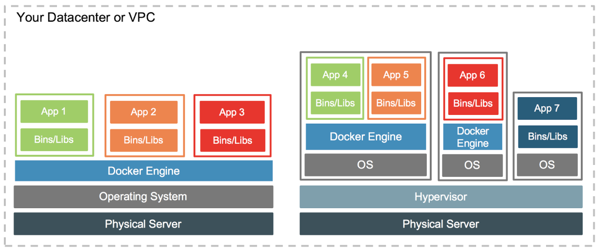
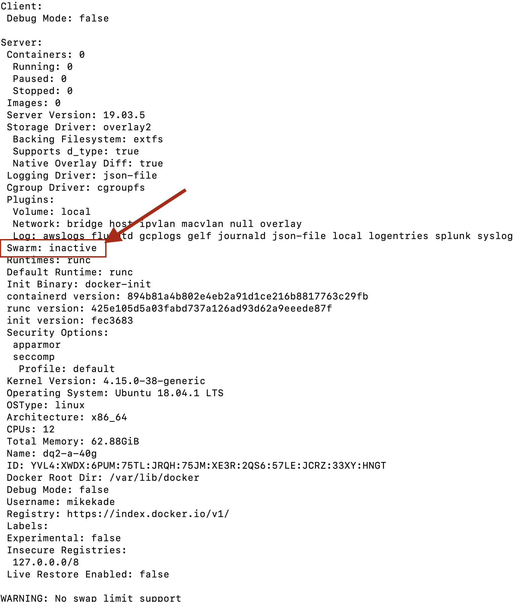

# Installing Docker for Ubuntu Server 18.04

## Table of Contents

   * [Why Docker?](#why-docker)
   * [Why companies embrace Docker containers](#why-companies-embrace-docker-containers)
   * [Can Docker co-exist on top of VMs?](#can-docker-co-exist-on-top-of-vms?)
   * [Installing Docker on Ubuntu 18.04](#installing-docker-on-ubuntu-18.04)
   * [Verifying that Docker is running on your machine](#verifying-that-docker-is-running-on-your-machine)
   * [Creating a Docker Swarm Cluster](#creating-a-docker-swarm-cluster)
   
## Why Docker?

Docker is a tool designed to make it easier to create, deploy, and run applications by using containers. Containers allow a developer to package up an application with all of the parts it needs, such as libraries and other dependencies, and ship it all out as one package. By doing so, thanks to the container, the developer of the application can rest assured that the application will run on any Linux machine regardless of any customized settings that machine might have that could differ from the machine used for writing and testing of the application.

## Why companies embrace Docker containers

So why does everyone love containers and Docker? James Bottomley, formerly Parallels' CTO of server
virtualization and a leading Linux kernel developer, explained VM hypervisors, such as Hyper-V,
KVM, and Xen, all are "based on emulating virtual hardware. That means they're fat in terms of
system requirements."


Containers, however, use shared operating systems. This means they are much more efficient than
hypervisors in system resource terms. Instead of virtualizing hardware, containers rest on top of
a single Linux instance. This means that you can "leave behind the useless 99.9 percent VM junk, leaving
you with a small, neat capsule containing your application." said Bottomley.

Therefore, according to Bottomley, with a perfectly tuned container system, you can have as many
as four-to-six times the number of server application instacnes as you can using Xen, KVM, or VMware on
the same hardware.

Docker enables developers to easily pack, ship, and run any application as a lightweight, portable,
self-sufficient container, which can run virtually anywhere. It is the ultimate in instant application
portability.

## Can Docker co-exist on top of VMs?

The answer is a resounding "yes".

At the most basic level VMs are a great place for Docker hosts to run. And by VMs I mean VMs in all their forms. Whether it’s a vSphere VM or a Hyper-V VM or a Xen Instance, all of them will serve equally well as a Docker host. Depending on what you need to do, a VM might be the best place to land those containers. But the great thing about Docker is that, it doesn’t matter where you run containers – and it’s totally up to you.

Can Docker container-based services interact with VM-based services? Again, the answer is absolutely yes. Running your application in a set of Docker containers doesn’t preclude it from talking to the services running in a VM.

Another area where there can be synergy between VMs and Docker containers is in the area of capacity optimization. VMs gained early popularity because the enabled higher levels of server utilization. That’s still true today. A vSphere host, for instance, can host VMs that may house Docker hosts, but may also host any number of traditional monolithic VMs. By mixing and matching Docker hosts with “traditional” VMs, sysadmins can be assured they are getting the maximum utilization out of their physical hardware.



## Installing Docker on Ubuntu 18.04

We are going to use Ubuntu Server 18.04 LTS as the example for our installation instructions. If your
hardware is running a different operating system, then you need to Google how to install **docker-ce**
on your system. Once that is done, then skip to [Creating a Docker Swarm Cluster](#creating-a-docker-swarm-cluster) in a future section.

1. Update the `apt` package index

```
$ sudo apt-get update
```

2. Install packages to allow `apt` to use a repository over HTTPS

```
$ sudo apt-get install \
    apt-transport-https \
    ca-certificates \
    curl \
    gnupg-agent \
    software-properties-common
```

3. Add Docker's official GPG key

```
$ curl -fsSL https://download.docker.com/linux/ubuntu/gpg | sudo apt-key add -
```

Verify that you now have the key with the fingerprint `9DC8 5822 9FC7 DD38 854A E2D8 8D81 803C 0EBF CD88`,
by searching for the last 8 characters of a fingerprint.

```
$ sudo apt-key fingerprint 0EBFCD88
    
pub   rsa4096 2017-02-22 [SCEA]
      9DC8 5822 9FC7 DD38 854A  E2D8 8D81 803C 0EBF CD88
uid           [ unknown] Docker Release (CE deb) <docker@docker.com>
sub   rsa4096 2017-02-22 [S]
```

4. Use the following command to setup the **stable** repository.

```
$ sudo add-apt-repository \
   "deb [arch=amd64] https://download.docker.com/linux/ubuntu \
   $(lsb_release -cs) \
   stable"
```

5. Install Docker Engine. Update the `apt` package index.

```
$ sudo apt-get update
```

6. Install the latest version of Docker Engine, the CLI, and containerd

```
$ sudo apt-get install docker-ce docker-ce-cli containerd.io
```

7. In order to create a docker swarm cluster, you will need to install docker on multiple machines. For
our Qumulo Audit Logs with Elasticsearch, it is best to have 4 docker machines. This will allow you to
have enough performance to run Elasticsearch. Remember that Elasticsearch is an indexing and search engine
that can handle billions and billions of entries in its database. Because of that, you will want to get
the best performance possible. Hence our comment on running docker on at least 4 physical or virtual
machines.

## Verifying that Docker is running on your machine

There are several simple tests to verify that docker is running successfully on your machine.

1. Where is docker installed

```
$ which docker
/usr/bin/docker
$
```

2. Verify docker is running as a system service

```
$ systemctl status docker
* docker.service - Docker Application Container Engine
   Loaded: loaded (/lib/systemd/system/docker.service; enabled; vendor preset: enabled)
   Active: active (running) since Fri 2020-01-10 20:04:23 UTC; 7min ago
     Docs: https://docs.docker.com
 Main PID: 31940 (dockerd)
    Tasks: 22
   CGroup: /system.slice/docker.service
           `-31940 /usr/bin/dockerd -H fd:// --containerd=/run/containerd/containerd.sock

Jan 10 20:04:23 dq2-a-40g dockerd[31940]: time="2020-01-10T20:04:23.615053201Z" level=warning msg="Your kernel
Jan 10 20:04:23 dq2-a-40g dockerd[31940]: time="2020-01-10T20:04:23.615069232Z" level=warning msg="Your kernel
Jan 10 20:04:23 dq2-a-40g dockerd[31940]: time="2020-01-10T20:04:23.615076333Z" level=warning msg="Your kernel
Jan 10 20:04:23 dq2-a-40g dockerd[31940]: time="2020-01-10T20:04:23.615205051Z" level=info msg="Loading contai
Jan 10 20:04:23 dq2-a-40g dockerd[31940]: time="2020-01-10T20:04:23.685720521Z" level=info msg="Default bridge
Jan 10 20:04:23 dq2-a-40g dockerd[31940]: time="2020-01-10T20:04:23.708173241Z" level=info msg="Loading contai
Jan 10 20:04:23 dq2-a-40g dockerd[31940]: time="2020-01-10T20:04:23.804389811Z" level=info msg="Docker daemon"
Jan 10 20:04:23 dq2-a-40g dockerd[31940]: time="2020-01-10T20:04:23.804439140Z" level=info msg="Daemon has com
Jan 10 20:04:23 dq2-a-40g dockerd[31940]: time="2020-01-10T20:04:23.816089919Z" level=info msg="API listen on 
Jan 10 20:04:23 dq2-a-40g systemd[1]: Started Docker Application Container Engine.
$
```

3. Get `docker info`

```
$ docker info
```


**Notice that the `docker info` output is highlighted to show that we are not yet a member of
a swarm cluster. We will address that in the next section.**

## Creating a Docker Swarm Cluster

Docker Engine Swarm mode enables you to create a cluster of one or more Docker Engines. A swarm consists of
one or more nodes; physical or virtual machines running Docker Engine in swarm mode.

There are two types of nodes: **managers** and **workers**


### Managers versus Workers

Manager nodes handle cluster management tasks:

- maintaining cluster state
- scheduling services
- serving swarm mode HTTP API endpoints

To take advantage of swarm mode's fault-tolerance features, Docker recommends that you implement an odd
number of nodes according to your organization's high-availability requirements, When you have multiple
managers, you can recover from the failure of a manager node without downtime.

**Important note:** Adding more managers does NOT mean increased scalability or higher performance.
In general, the opposite is true.

Worker nodes are also instance of Docker Enginer whose sole purpose is to execute containers. Workers don't
participate in state or scheduling decisions, or serve the swarm mode HTTP API.

You can create a swarm of one manager node, but you cannot have a worker node without at least one manager
node. By default, **all managers are also workers**.

In a cluster, it is always best to have at least three managers nodes for full fault tolerance. The rest can
be worker nodes for better performance.

Now, that you understand the basics of what is a manager and a worker, let's go and create a swarm
cluster. 

1. Run the following command to create a new swarm:

```
$ docker swarm init --advertise-addr <MANAGER-IP>
```

On our machine, the output looks like:

```
root@dq2-a-40g:~/kade/qumulo-docker-elasticsearch# docker swarm init --advertise-addr 10.220.246.26
Swarm initialized: current node (zb7cv4jnhoab208dixosjxm84) is now a manager.

To add a worker to this swarm, run the following command:

    docker swarm join --token SWMTKN-1-31vfrcq5q3xy008tb4l07fkghyxn1f7nfvd7cpcor5skxmjdz8-3se3xfrswgdczu0df06qgm7lz 10.220.246.26:2377

To add a manager to this swarm, run 'docker swarm join-token manager' and follow the instructions.

root@dq2-a-40g:~/kade/qumulo-docker-elasticsearch#
```

The `--advertise-addr` flag configures the manager node to publish its address as `10.220.246.26`.
The other nodes in the swarm must be able to access the manager at the IP address. Of course,
the <MANAGER-IP> for your configuration would be the IP Address of the Ubuntu Server where
you just ran the **docker swarm init** command. 

The output includes the command to join new nodes to the swarm. Nodes will join as managers or workers
depending upon the value for the `--token` flag.

2. Run `docker info` to view the current state of the swarm

```
root@dq2-a-40g:~/kade/qumulo-docker-elasticsearch# docker info
Client:
 Debug Mode: false

Server:
 Containers: 0
  Running: 0
  Paused: 0
  Stopped: 0
    ... snip ...
 Swarm: active
  NodeID: zb7cv4jnhoab208dixosjxm84
  Is Manager: true
  ClusterID: 5zkp46brdo45zo60sabgcpnah
  Managers: 1
  Nodes: 1
    ... snip ...
root@dq2-a-40g:~/kade/qumulo-docker-elasticsearch#
```

3. Finally, run the `docker node ls` command to view information about the nodes

```
root@dq2-a-40g:~/kade/qumulo-docker-elasticsearch# docker node ls
ID                            HOSTNAME            STATUS              AVAILABILITY        MANAGER STATUS      ENGINE VERSION
zb7cv4jnhoab208dixosjxm84 *   dq2-a-40g           Ready               Active              Leader              19.03.5
root@dq2-a-40g:~/kade/qumulo-docker-elasticsearch#
```

The `*` next to the node ID indicates that you're currently connect to this node.

4. Join 3 more machines to the swarm cluster

Go to your first docker node and run the command `docker swarm join-token manager`. This will ask docker to
generate a join token so that the new server (node) can become a manager.

```
root@dq2-a-40g:~# docker swarm join-token manager
To add a manager to this swarm, run the following command:

    docker swarm join --token SWMTKN-1-31vfrcq5q3xy008tb4l07fkghyxn1f7nfvd7cpcor5skxmjdz8-8xqicnop6zy7ltsehz2fzq8w7 10.220.246.26:2377

root@dq2-a-40g:~#
```
Now, take the output of that command and execute that on the second server.. When you are done, you
should see the following.

```
root@dq2-d-40g:~# docker swarm join --token SWMTKN-1-31vfrcq5q3xy008tb4l07fkghyxn1f7nfvd7cpcor5skxmjdz8-8xqicnop6zy7ltsehz2fzq8w7 10.220.246.26:2377
This node joined a swarm as a manager.
root@dq2-d-40g:~#
```

Do this two more times with the other servers in which you installed docker. When you have completed that,
run the command `docker info` on your first swarm node. You should see something like the following.

```
root@dq2-a-40g:~# docker info
Client:
 Debug Mode: false

Server:
 Containers: 0
  Running: 0
  Paused: 0
  Stopped: 0
 Images: 0
 Server Version: 19.03.5
  ... snip ...
 Swarm: active
  NodeID: zb7cv4jnhoab208dixosjxm84
  Is Manager: true
  ClusterID: 5zkp46brdo45zo60sabgcpnah
  Managers: 4
  Nodes: 4
  ... snip ...
  Manager Addresses:
   10.220.246.26:2377
   10.220.246.27:2377
   10.220.246.28:2377
   10.220.246.29:2377
  ... snip ...

WARNING: No swap limit support
root@dq2-a-40g:~#
```

And, then run the command `docker node ls`. You should see the four servers (nodes) for the docker swarm
cluster.

```
root@dq2-a-40g:~# docker node ls
ID                            HOSTNAME            STATUS              AVAILABILITY        MANAGER STATUS      ENGINE VERSION
zb7cv4jnhoab208dixosjxm84 *   dq2-a-40g           Ready               Active              Leader              19.03.5
c6y6ut54bv2rc2mnwuqad3evk     dq2-b-40g           Ready               Active              Reachable           19.03.5
kquuwptylv7tws8h0yyt0k2d5     dq2-c-40g           Ready               Active              Reachable           19.03.5
nkd75o11d56n662zhu3hnj5xq     dq2-d-40g           Ready               Active              Reachable           19.03.5
root@dq2-a-40g:~#
```

## Finished

Congratulations! You have finished installing Docker Engine and creating a swarm cluster with four management
nodes. Admittedly, we could have create a three node management cluster and added a single worker. However,
for our four node cluster, four management nodes is far simpler. If you wish to add more nodes to the cluster
in the future, then add only worker nodes as you already have a completely fault tolerant manager setup
for docker.

With this configuration, you are about to enter a whole new world of quick application implementation without
all of the overhead of managing multiple VM guest images.
