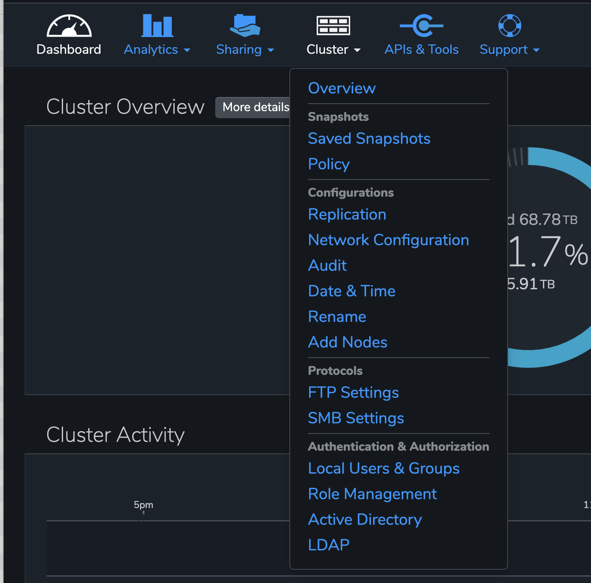
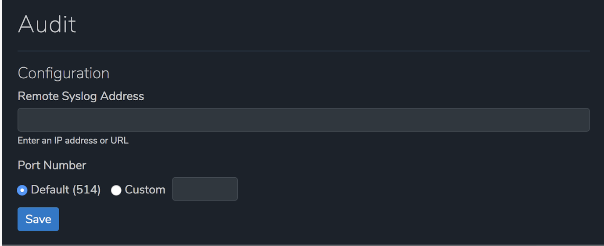
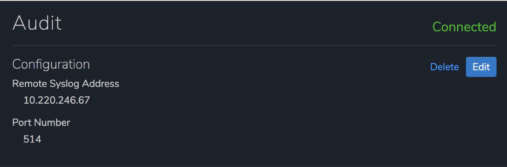

# How to configure rsyslog on Ubuntu 18.04 for Qumulo Audit Logs

## Table of Contents

   * [Qumulo Audit Logging](#qumulo-audit-logging)
   * [Log Field Definitions](#log-field-definitions)
   * [Configuration with rsyslog](#configuration-with-rsyslog)
   * [Configure Logrotate](#configure-logrotate)
   * [Enable Audit Logging via the UI](#enable-audit-logging-via-the-ui)
   * [Enable Audit Logging via the CLI](#enable-audit-logging-via-the-cli)
      
## Qumulo Audit Logging

Audit Logging in Qumulo Core provides a mechanism for tracking filesystem operations and configuration
changes. As connected clients issue requests to the cluster, log messages are generated describing
each attempted operation. These log messages are then sent over the network to the remote syslog instance
specified by the current audit configuration in compliance with
[RFC 5424](https://tools.ietf.org/html/rfc5424).

Each audit log message body consists of a few fields in CSV (comma delimited) format. Note that the user id
and both file path fields are quoted since they may contain characters that need to be escaped. In addition
to escaping characters, we also strip all newline characters ("\n" or "\r") from these three fields.

The fields are described below in the order that they display within the log message body:

```
10.220.200.26,groot-1,"AD\alice",smb2,fs_read_data,ok,123,"/Mike/docs/image.png",""
```

## Log Field Definitions

The fields within the log file entries are:

**User IP** - The IP address of the user in IPV4/IPV6 format

**Node** - The node in the Qumulo cluster that generated the log entry

**User ID** - The user that performed the action. The user id can be of the form:

- AD username
- Qumulo local username
- POSIX UID
- Windows SID
- Qumulo auth ID (only if Qumulo fails to resolve the user ID to any of the previous types)

**Logins** - Any successful or unsuccessful login attempt by the user for the operation below:

- Session login via the Web UI
- Session login via the qq CLI
- SMB login
- NFS mount
- FTP login

**Protocol** - The protocol that the user request came through

- nfs3
- nfs4
- smb2
- smb3
- ftp
- api

**File System Operation** - The operation that the user attempted

- fs_create_directory
- fs_create_file
- fs_create_hard_link
- fs_create_symlink
- fs_create (a filetype other than the types capture above)
- fs_delete
- fs_fsstat
- fs_read_metadata
- fs_list_directory
- fs_open
- fs_read_data
- fs_read_link
- fs_rename
- fs_write_data
- fs_write_metadata

**Management Operation** - Any operation that modified the cluster configuration

- auth_create_user
- smb_create_share
- smb_login
- nfs_create_export
- nfs_mount
- snapshot_create_snapshot
- replication_create_source_relationship

**Error Status** - "ok" if the operation succeeded or a Qumulo specified error code if the operation failed.

Keep in mind that error status codes are subject to change with new releases of Qumulo Core and may differ
depending on the version you have installed on your cluster

<table>
  <tr>
    <th>**Error Status**</th>
    <th>**Details**</th>
  </tr>
  <tr>
    <td>ok</td>
    <td>The operation was successful.</td>
  </tr>
  <tr>
    <td>fs_no_such_path_error</td>
    <td>The directory portion of the path contains a name that doesn't exist.</td>
  </tr>
  <tr>
    <td>fs_no_space_error</td>
    <td>The file system has no available space. Your cluster is 100% full.</td>
  </tr>
  <tr>
    <td>fs_invalid_file_type_error</td>
    <td>The operation isn't valid for this filetype.</td>
  </tr>
  <tr>
    <td>fs_not_a_file_error</td>
    <td>The operation (e.g. read) is only valid for a file.</td>
  </tr>
  <tr>
    <td>fs_sharing_violation_error</td>
    <td>The file or directory is opened by another party in an exclusive manner.</td>
  </tr>
  <tr>
    <td>fs_no_such_entry_error</td>
    <td>The directory, file, or link does not exist in the file system.</td>
  </tr>
  <tr>
    <td>fs_access_denied_error</td>
    <td>The user does not have access to perform the operation.</td>
  </tr>
  <tr>
    <td>fs_access_perm_not_owner_error</td>
    <td>The user would need superuser or owner access to perform the operation.</td>
  </tr>
  <tr>
    <td>fs_entry_exists_error</td>
    <td>A file system object with the given name already exists.</td>
  </tr>
  <tr>
    <td>fs_directory_not_empty_error</td>
    <td>The directory cannot be removed because it is not empty.</td>
  </tr>
  <tr>
    <td>fs_no_such_inode_error</td>
    <td>The file system object does not exist.</td>
  </tr>
  <tr>
    <td>http_unauthorized_error</td>
    <td>The user does not have access to perform the management operation.</td>
  </tr>
  <tr>
    <td>share_fs_path_doesnt_exist_error</td>
    <td>The directory does not exist on the cluster.</td>
  </tr>
  <tr>
    <td>decode_error</td>
    <td>Invalid json was passed to the API.</td>
  </tr>
</table>

**File id** - The ID of the file that the operation was on

**File path** - The path of the file that the operation was on

When accessing a file through a snapshot, the path is prefixed with a "/.snapshot/<snapshot-directory>";
which is the same path prefix used to access snapshot files via nfs and smb.

**Secondary file path** - Any rename or move operations

**IMPORTANT!!** In order to keep the amount of audit log message to a minimum, similar operations performed
in rapid succession will be de-duplicated. For example, if a user reads the same file 100,000 times in a
minute, only one message corresponding to the first read will be generated.

## Configuration with Rsyslog

For the following example, our client will be running Ubuntu 18.04. If you are using a different version
of Linux, you may need to Google how to configure rsyslog for specifics.

### Global rsyslog configuration

Start by updating the global rsyslog configuration to allow receiving syslog messages over TCP connections.
In the **/etc/rsyslog.conf** file, uncomment the following lines to listen for TCP connections on port 514.
If you choose to use a different port, then also change the port referenced to match your desired
configuration.

```
# provides TCP syslog reception
module(load="imtcp")
input(type="imtcp" port="514")
```

### Create new Qumulo Audit Log configuration

Rsyslog loads dedicated log file format definitions from the **/etc/rsyslog.d** directory. We will need
to create a new configuration file for defining the Qumulo Audit Log format.

Using your favorite text based editor, edit the file **/etc/rsyslog.d/10-qumulo-audit.conf** and add
the following content.

```
# Log file name:"/var/log/qumulo/node-hostname.log"
template(name="QumuloFileName" type="list") {
constant(value="/var/log/qumulo/")
property(name="hostname")
constant(value=".log")
}

# Log message format: "timestamp,audit-msg-csv-fields..."
template(name="QumuloAuditFormat" type="list") {
property(name="timestamp" dateFormat="rfc3339")
constant(value=",")
property(name=”hostname”)
constant(value=”,”)
property(name="msg")
constant(value="\n")
}

# Filter to catch all Qumulo audit log messages.
if ($app-name startswith "qumulo") then {
action(type="omfile" dynaFile="QumuloFileName" template="QumuloAuditFormat")
stop
}
```

### Previous KnowledgeBase Article

If you have read a previous KnowledgeBase article entitled **Qumulo Core Audit Logging**, please note
that the **/etc/rsyslog.d/10-qumulo-audit.conf** file mentioned in that article is different than the
one listed above. If you have previously created this file, then modify it to match the above configuration
and restart rsyslog.

### /var/log/qumulo directory and permissions

The Elasticsearch docker example, that this rsyslog configuration is based upon, depends upon the
directory **/var/log/qumulo** existing and having the correct permissions.

Create the directory if it doesn't already exist.

```
mkdir -p /var/log/qumulo
```

Make sure to apply the correct permissions so that the syslog daemon can write to it.

```
chown syslog.adm /var/log/qumulo
```

### Restart the rsyslog daemon

In order for the new Qumulo Audit Log configuration to be active, you must first restart the
rsyslog daemon on the server.

```
systemctl restart rsyslog
```

## Configure Logrotate

Qumulo Audit Log files are intended to retain information about users and file activities for a
reasonable period of time, but there is no guarantee or means to control the size of those log files.
Linux has the capability through **logrotate** to rotate the log files. If left unchecked, Qumulo Audit
Log files can grow to consume all of the available disk space on the server in which they reside.

To prevent log files from filling up your system completely, the log messages can be rotated, meaning that
when a certain threshold has been reached, the old log file is closed and a new log file is opened.

### What is log rotation?

Log rotate is a process that solves these problems by periodically archiving the current log file and
starting a new one. It renames and optionally compresses the current log files, deletes old log files,
and force the logging system to begin new log files. It usually runs automatically through the _cron_
utility. With log rotation, you can

- start a new log file on a schedule, such as daily, weekly, or monthly
- compress old log files to save disk space
- prune old archives so that you keep a certain number of old logs
- rename old log files with a date stamp so you know where to look for older logs
- run command before or after a set of logs is rotated

### Configuration files of logrotate

On Ubuntu 18.04, the logrotate configuration files are in **/etc/logrotate.conf**,
along with any files in **/etc/logrotate.d**. The main _logrotate.conf_ file specifies any default
settings and system file to be rotated. You should not need to edit or change this file in any way.

### Setting up log rotation for Qumulo Audit Logs

The core of log rotation occurs in individual configuration files in the **/etc/logrotate.d** directory.
The files in this directory are executed once per day when the logrotate process is invoked.

A sample logrotate file for the Qumulo Audit Logs is included in the **logrotate** directory of
this github repo. In that directory, you will find a file called **qumulo**. Simply copy that file
to the **/etc/logrotate.d** directory and, when logrotate next runs, the Qumulo Audit Logs will
be rotated.

The **qumulo** configuration file for logrotate looks like:

```
/var/log/qumulo/*.log {
        daily
        missingok
        notifempty
        rotate 4
        size 50M
        dateext
        dateformat -%Y-%m-%d
        postrotate
             /usr/lib/rsyslog/rsyslog-rotate
        endscript
}
```

The parameters are:

**/var/log/qumulo/*.log** - The directory and files that will be worked on. Since we configured rsyslog
to store the Qumulo Audit Logs in **/var/log/qumulo**, this is the directory that logrotate should examine.

**daily** - How often to examine the Qumulo Audit Logs and determine if they should be rotated. Since,
logrotate only runs once per day, you can only change this value to **weekly** or **monthly**.

**missingok** - Instructs logrotate that it is **ok** to have missing log files.

**notifempty** - Don't rotate files if they are empty.

**rotate 4** - Only rotate and keep 4 files. You can change this to any value that you like.

**size 50M** - Only rotate log files that reach 50MB in size. You might want to make this smaller,
but probably shouldn't make this much larger.

**dateext** - Uses the date as an extension for old log files

**dateformat -%Y-%m-%d** - When rotating the log files, change the file name and append a date of
the format YYYY-mm-dd. So, a log file of **groot-1.log** becomes **groot-1.log.2020-01-15**.

**postrotate** - This is a command to execute up to the **endscript** statement. Because rsyslog
will continue to use the old log files until you inform it that they have changed,
we have used the included linux script **/usr/lib/rsyslog/rsyslog-rotate**; which will send a TERM signal
to rsyslog. This TERM signal will inform rsyslog to switch to a new log file.

## Enable Audit Logging via the UI

Now that you have configured the rsyslog server to receive Qumulo Audit Logs, it is time to configure
the Qumulo cluster to communicate with the rsyslog server that you just configured.

1. Start by clicking on the **Cluster** menu and click **Audit**.

<p align="center">

</p>

2. Fill in the following fields:

- **Remote Syslog Address** - The IP address or URL of your rsyslog server.
- **Port Number** - The port number that you configured for your rsyslog server.

<p align="center">

</p>

3. Click **Save**

4. Certify that the status shows as **Connected** and that all configuration details are correct
on the Audit page.

If you need to change the configuration, click the **Edit** button to modify the settings or select
**Delete** to disable audit logging on your cluster.

<p align="center">

</p>

## Enable Audit Logging via the CLI

Run the following qq command, including a specific IP address (or URL) and port number, to enable
Audit Logging:

```
qq audit_set_config --enable --server-address <syslog-server-hostname> --server-port <port-number>
```

To disable audit logging, use the following command:

```
qq audit_set_config --disable
```

To review the current configuration for audit logging, run the following:

```
qq audit_get_config
```

Sample Output:

```
qq audit_get_config
{
"enabled": true,
"server_address": "10.220.200.26",
"server_port": 514
}
```

Use the qq command below to check the current state of the connection with the remote syslog instance:

```
qq audit_get_status
```

The connection_status included in the output will be one of the following:

- **AUDIT_LOG_CONNECTED** - The connection with the remote syslog instance has been established and all
log messages should be successfully transmitted.
- **AUDIT_LOG_DISCONNECTED** - There is no active connection to the remote syslog instance. The cluster will
attempt to buffer all outgoing log messages until the connection can be re-established, at which point the
buffered messages will be sent to the remote syslog instance. If a power outage or reboot occurs, all
unsent messages will be lost. If the message buffer fills up, all new messages will be thrown away.
- **AUDIT_LOG_DISABLED** - Audit logging has been explicitly disabled.

Check out the sample output of an established syslog instance below:

```
qq audit_get_status
{
"connection-status": "AUDIT_LOG_CONNECTED"
}
```

## Verify Qumulo Audit Logs

Since we have configured **/var/log/qumulo** as the directory in which we want to store the Qumulo Audit
Logs, verifying that everything is working correctly is quite simple.

In order to view if logs are being written, login to the Ubuntu server where you configured rsyslog. Then,
run the command:

```
ls -l /var/log/qumulo
```

You should see something like:

```
root@dq2-a-40g:/var/log/qumulo# ls -l /var/log/qumulo
total 3210844
-rw-r--r-- 1 syslog syslog  21193194 Jan 13 17:26 baby-groot-1.log
-rw-r--r-- 1 syslog syslog     40533 Jan 13 21:22 baby-groot-2.log
-rw-r--r-- 1 syslog syslog       513 Jan 13 17:26 baby-groot-3.log
-rw-r--r-- 1 syslog syslog      2120 Jan 13 18:02 baby-groot-4.log
-rw-r--r-- 1 syslog syslog      3403 Jan 13 17:59 baby-groot-5.log
-rw-r--r-- 1 syslog syslog      5728 Jan 13 17:51 baby-groot-6.log
-rw-r--r-- 1 syslog syslog 130791299 Jan 14 02:51 groot-1.log
-rw-r--r-- 1 syslog syslog 978088566 Jan  9 23:36 groot-1.log-2020-01-09
-rw-r--r-- 1 syslog syslog 201909679 Jan 11 06:25 groot-1.log-2020-01-11
-rw-r--r-- 1 syslog syslog 156490287 Jan 12 06:24 groot-1.log-2020-01-12
-rw-r--r-- 1 syslog syslog 156671182 Jan 13 06:25 groot-1.log-2020-01-13
-rw-r--r-- 1 syslog syslog  71506548 Jan 14 02:51 groot-2.log
-rw-r--r-- 1 syslog syslog 533193280 Jan  9 23:36 groot-2.log-2020-01-09
-rw-r--r-- 1 syslog syslog 110679565 Jan 11 06:25 groot-2.log-2020-01-11
-rw-r--r-- 1 syslog syslog  85755381 Jan 12 06:24 groot-2.log-2020-01-12
-rw-r--r-- 1 syslog syslog  85742601 Jan 13 06:25 groot-2.log-2020-01-13
-rw-r--r-- 1 syslog syslog  60764816 Jan 14 02:51 groot-3.log
-rw-r--r-- 1 syslog syslog 453419669 Jan  9 23:36 groot-3.log-2020-01-09
-rw-r--r-- 1 syslog syslog  94183825 Jan 11 06:24 groot-3.log-2020-01-11
-rw-r--r-- 1 syslog syslog  72874080 Jan 12 06:24 groot-3.log-2020-01-12
-rw-r--r-- 1 syslog syslog  72939093 Jan 13 06:25 groot-3.log-2020-01-13
-rw-r--r-- 1 syslog syslog    610767 Jan 14 02:51 groot-4.log
-rw-r--r-- 1 syslog syslog    407103 Jan 14 00:17 groot-5.log
-rw-r--r-- 1 syslog syslog    490019 Jan 14 02:49 groot-6.log
```

As you can see by the above example, the Qumulo Audit Logs have been running for several days on two
different clusters; named **baby-groot** and **groot**. In the case of both clusters, there are 6 nodes. You
can tell this by the fact that we have a file for each node of the cluster. In this case,
**baby-groot-1.log** through **baby-groot-6.log** and the same for **groot-1.log** through **groot-6.log**.

Also note that you can see that **logrotate** is configured on this rsyslog server using the example above
in [Configure Logrotate](#configure-logrotate).

If you read this section on how to configure logrotate, you can see that we have configured it
to rotate the logs if they exceed 50MB in size for each file. Since we have a large workflow constantly
running on the cluster **groot**, you can see why the log files have rotated for this cluster and not
for the cluster **baby-groot**.
